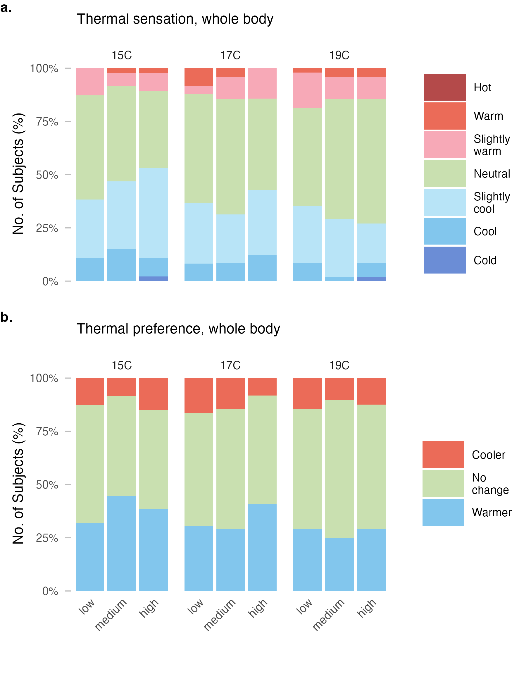
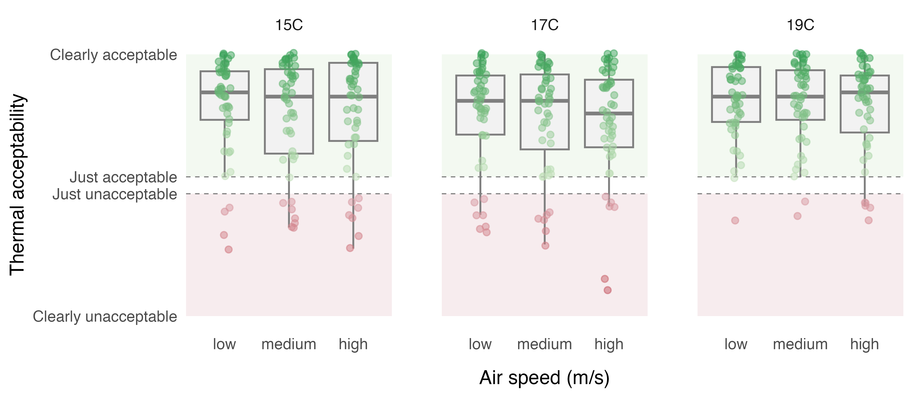
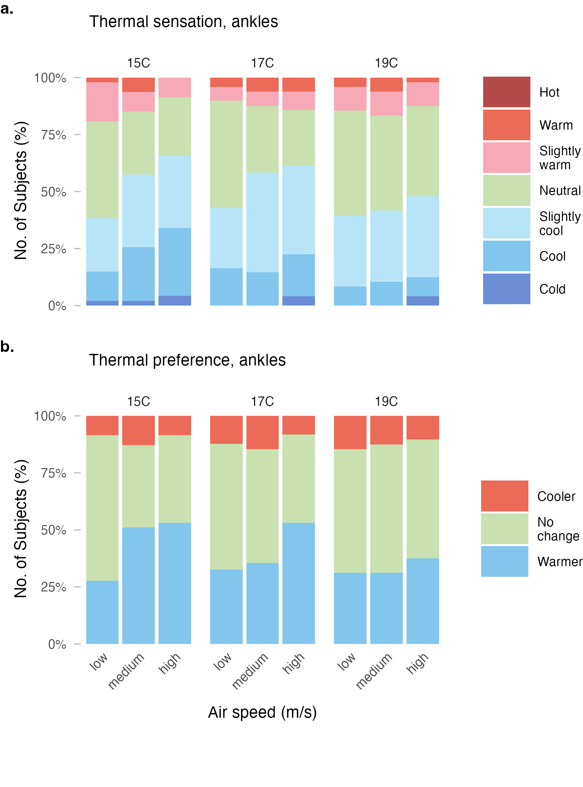
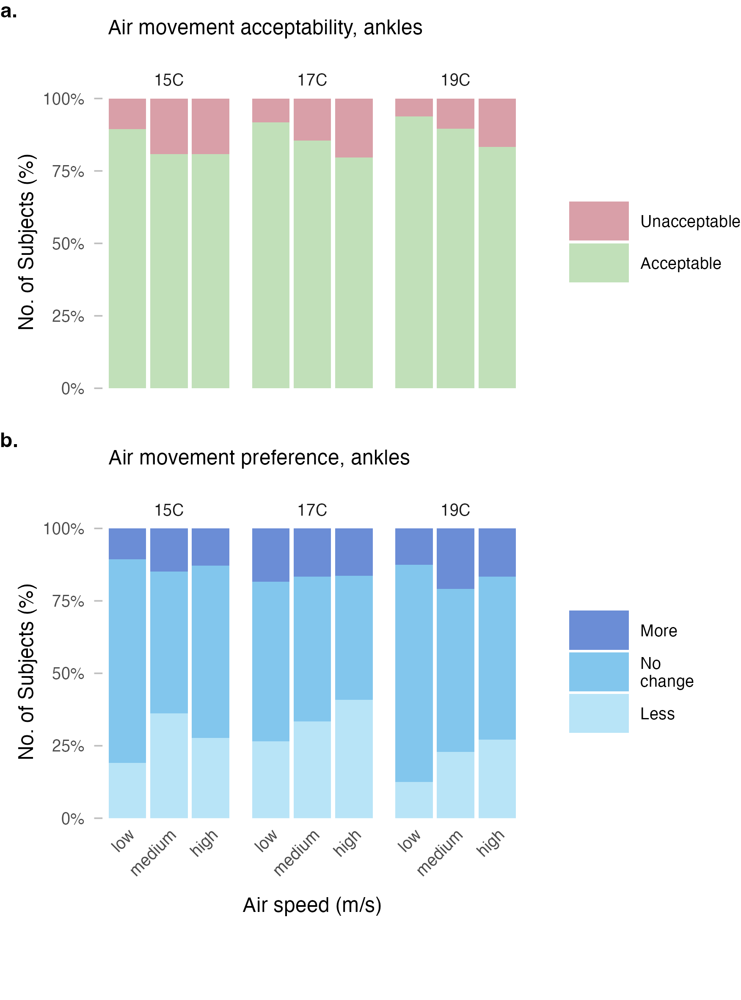

```{r load-main-analysis}
#| message: false
#| warning: false
#| paged-print: false
source(here::here("src", "R", "x_analysis.R"))
```

# Abstract {.unnumbered}

<!-- Draft after results are finalized -->

# Introduction

Cold downdraft near windows is a common source of local thermal
discomfort in buildings during winter. When outdoor temperatures drop,
the interior surface of windows, particularly large or poorly insulated
glazing, becomes significantly cooler than the surrounding air. This
temperature differential causes nearby air to cool, increase in density,
and descend, creating a localized airflow pattern that can cause
discomfort at the lower extremities of seated occupants
[@heiselbergDraftComfortReview1994
<!--# Replace reference with BetterBibTex -->]. Building designers
typically address this issue by installing perimeter heating systems,
such as radiators or in-floor heating, to counteract the downdraft
effect and maintain occupant comfort.

The current approach to evaluating ankle draft risk relies on a
predictive model presented in @liuPredictedPercentageDissatisfied2017,
which estimates the predicted percentage dissatisfied (PPD) with ankle
draft as a function of air speed and temperature at ankle level, as well
as whole-body thermal sensation. This model, now incorporated into
ASHRAE Standard 55 [@ashraeANSIASHRAEStandard2023], was derived from
laboratory experiments conducted under cooling conditions typical of
underfloor air distribution (UFAD) and displacement ventilation systems.
Importantly, participants in these foundational studies, including an
earlier investigation by @schiavonSensationDraftUncovered2016, wore
summer clothing with exposed ankles, resulting in clothing insulation
levels of approximately 0.5 clo.

However, building occupants in winter typically wear substantially
different attire. Analysis of the ASHRAE Global Thermal Comfort Database
II [@foldvarylicinaDevelopmentASHRAEGlobal2018] indicates that median
clothing insulation in office environments during heating seasons is
approximately 0.75 clo, with occupants commonly wearing long trousers,
closed-toe shoes and socks that cover the ankle region. This discrepancy
raises an important question: does the existing ankle draft model,
calibrated for summer conditions with exposed skin, accurately predict
discomfort when ankles are covered by clothing?

If the current model overestimates draft risk under winter clothing
conditions, the practical implications are significant. Designers may be
specifying perimeter heating systems that are larger than necessary, or
installing them in situations where they could be avoided entirely. This
has consequences for both first costs and operational energy
consumption, as perimeter heating systems contribute to building energy
use and associated carbon emissions. Conversely, if the model
underestimates risk, occupants may experience discomfort that
compromises satisfaction and productivity.

The objective of this study is to evaluate thermal comfort responses to
ankle-level draft under winter clothing conditions through controlled
laboratory experiments. Specifically, we aim to: (1) characterize local
and whole-body thermal sensation and comfort responses across a range of
supply air temperatures and air speeds representative of window
downdraft conditions; (2) compare observed dissatisfaction rates with
predictions from the existing ankle draft model; and (3) assess whether
the current ASHRAE 55 criteria require adjustment for winter scenarios.
The findings are intended to inform guidance on perimeter heating
requirements and support more energy-efficient building design without
compromising occupant comfort.

# Methods {#sec-methods}

## Experimental design

We conducted a controlled laboratory experiment using a within-subjects
repeated-measures design. Each participant was exposed to nine
experimental conditions in a 3×3 factorial arrangement, varying supply
air temperature (SAT) at three levels (15°C, 17°C, 19°C) and air speed
at ankle level at three levels (low, medium, high; ranging between
0.1–0.7 m/s). The SAT and air speeds were selected to represent the
range of conditions associated with window downdraft under typical
winter conditions, informed by computational fluid dynamics simulations
conducted as part of a broader research collaboration
<!--# This is not correct; how can we justify the selection given that the CFD will probbably not go ahead? -->.

Participants attended four sessions: an introductory session for
explaining the experiment and obtaining consent, followed by three
experimental sessions of approximately two hours each. Each experimental
session corresponded to one SAT level, with participants experiencing
all three air speed conditions within that session in a counterbalanced
order. Sessions were scheduled on separate days to minimize carryover
effects and subjects were allowed to attend the three sessions in their
preferred order.

## Climate chamber and apparatus

The experiment was conducted in a climate-controlled chamber at the
Center for the Built Environment, UC Berkeley. The chamber floor area is
approximately 25 m², configured with up to three workstations to allow
simultaneous testing of multiple participants. Ambient room conditions
were maintained at approximately 22°C operative temperature, 50%
relative humidity, and background air velocity below 0.1 m/s, targeting
a whole-body thermal sensation of approximately −0.5 (slightly cool) on
the ASHRAE seven-point scale.

PLACEHOLDER GRAPHIC

A custom displacement diffuser was used to deliver conditioned air to
the ankle region of seated participants. The diffuser was positioned 0.7
m behind each workstation, directing airflow toward the participants'
lower legs from behind and simulating the approach direction of window
downdraft. The diffuser was connected to an independent air handling
unit capable of delivering supply air at the target temperatures and
flow rates. Turbulence intensity at the measurement location was
approximately 30%, consistent with values reported in prior ankle draft
studies [@liuPredictedPercentageDissatisfied2017].

## Environmental monitoring

Air temperature was measured at head-height at each workstation using
calibrated Atmocube monitors (Atmotech Inc., United States; air
temperature: -40 to +125°C, ± 0.5°C, relative humidity: 0 to 100%RH, ± 2
%RH, CO~2~: 0 to 5000 ppm, ± 50 ppm + 2.5% of reading at standard room
levels) positioned within 0.5 m of participants. Air velocity at ankle
level (0.1 m) was measured using AirDistSys 5000 omnidirectional
hot-wire anemometers (Sensor Electronic, Poland, air velocity: 0.05-5
m/s, accuracy: ±0.02 m/s ±2% of reading; temperature: -10 to +50°C,
accuracy: ±0.2°C, sampling interval: 1 s). Supply air temperature was
monitored continuously at the diffuser outlet. Room-level measurements
of relative humidity and CO~2~ concentration were recorded throughout
each session.

## Participants

We recruited participants from the university community and local area
through the Experimental Social Science Laboratory (Xlab) platform and
email outreach to individuals who had participated in previous studies
and consented to future contact. Eligible participants were between 21
and 55 years of age, fluent in English, and free from chronic
cardiorespiratory conditions or recent major surgery. Pregnant
individuals were excluded.

<!-- Add: final sample size, demographics summary from analysis -->

## Clothing protocol

To simulate typical winter office attire, participants were instructed
to wear a long-sleeve top, long trousers (ending just above the ankle),
thin socks, and closed-toe shoes. This ensemble targets a clothing
insulation of approximately 0.75 clo, consistent with the median value
observed in office buildings during heating seasons
[@foldvarylicinaDevelopmentASHRAEGlobal2018]. Participants were
permitted to make minor clothing adjustments during sessions (e.g.,
rolling sleeves), and any changes were recorded.

## Experimental protocol

Upon arrival for each experimental session, participants were checked
for elevated temperature and fitted with iButton skin temperature
sensors ((Thermochron, Maxim Integrated, USA, Type DS1923, 20°C to 85°C,
accuracy: ±0.1°C, resolution: 0.0625°C) at standardized locations (lower
leg, feet). Participants then entered the climate chamber and completed
a 20-minute adaptation period at their assigned workstation under
baseline conditions.

Following adaptation, participants were exposed to three consecutive
20-minute conditions at different air speed levels, with 20-minute rest
periods between conditions. The sequence of air speed conditions was
counterbalanced across participants and sessions. During each exposure
period, participants completed standardized questionnaires at the end of
each interval.

## Subjective measurements

The perception of the thermal environment was assessed using validated
scales consistent with prior ankle draft research and ASHRAE Standard 55
requirements. Constructs and their scales used in the questionnaires are
summarized in @tbl-scales below.

```{r}
#| label: tbl-scales
#| tbl-cap: "Survey constructs and measurement scales"
#| tbl-colwidths: [15,25,15,45]
#| echo: false

readr::read_csv("tables/survey_scales.csv") |>
  knitr::kable()
```

Surveys were administered electronically via Qualtrics. Participants
were not required to respond to any individual question, though
completion rates were monitored.

## Physiological measurements

Skin temperature was recorded continuously using the iButton sensors
attached with medical-grade hypoallergenic tape. Sensors were placed on
the lateral lower leg (mid-calf) and feet. Skin temperature data were
used to assess local cooling responses and as physiological correlates
of subjective thermal sensation.

## Statistical analysis and data processing

<!-- Describe analysis approach after methods are finalized -->

# Results

## Participants and environmental conditions

```{r demographics, echo=FALSE}
#| label: tbl-demographics
#| tbl-cap: "Summary of demographic information (mean ± SD) on study participants."

knitr::kable(demographic_d,
             col.names = c('Sex', 'No. Subjects', 'Age [a]', 'Height [m]', 'Weight [kg]', 'Body Mass Index (BMI)')
)

```

@tbl-demographics summarizes the demographic information of the study subjects. A total of `r demographic_d %>% dplyr::filter(sex == "All") %>% dplyr::pull(n)` subjects 
participated in the study (`r demographic_d %>% dplyr::filter(sex == "Female") %>% dplyr::pull(n)` 
female, `r demographic_d %>% dplyr::filter(sex == "Male") %>% dplyr::pull(n)` male, 
`r demographic_d %>% dplyr::filter(sex == "Third Gender / Other") %>% dplyr::pull(n)` other), with a mean age of `r demographic_d %>% dplyr::filter(sex == "All") %>% dplyr::pull(age)` years.

```{=html}
<!--
- Final sample size, completion rate, demographics (age, sex distribution)
- Table: Achieved environmental conditions by SAT level and air speed condition
  (mean ± SD for air temp, supply temp, air velocity at ankle, RH)
- Brief statement confirming conditions were achieved as designed
-->
```

```{r env, echo=FALSE}
#| label: tbl-env
#| tbl-cap: "Summary of environmental measurements."

knitr::kable(env_airflow_t,
             col.names = c('Measurement', '15C', '17C', '19C')
)
```

@tbl-env provides an overview of the measured environmental conditions. Across all three sessions, 
head-level air temperature remained stable at
`r env_airflow_t %>% dplyr::filter(measurement == "Air temperature, head level (°C)") %>% dplyr::pull("15C")` °C,
`r env_airflow_t %>% dplyr::filter(measurement == "Air temperature, head level (°C)") %>% dplyr::pull("17C")` °C, and
`r env_airflow_t %>% dplyr::filter(measurement == "Air temperature, head level (°C)") %>% dplyr::pull("19C")` °C,
and relative humidity was comparable across sessions, confirming stable background thermal conditions.

As the primary experimental manipulation, we set supply air temperatures to 15°C, 17°C, and 19°C 
to simulate the effect of window downdraft. Ankle-level temperatures were slightly higher than the 
supply temperature due to mixing with the warmer ambient air, but 
remained stable across all sessions. Within each session, we exposed subjects to three airspeed 
levels at separate workstations. We measured consistent air speeds across all three workstations and 
sessions, confirming reliable reproduction of the low, medium, and high airspeed conditions. 
Turbulence intensities remained low throughout, indicating stable and controlled airflow.

## Whole body thermal perception

```{r}
#| label: whole-body-helpers
#| echo: false

# Helper functions for inline text
get_sensation_pct <- function(sat, ws, response) {
  thermal_sensation_overall_summary %>%
    dplyr::filter(session_sat == sat, workstation == ws, response_value == response) %>%
    dplyr::pull(pct_label)
}

get_preference_pct <- function(sat, ws, response) {
  thermal_preference_overall_summary %>%
    dplyr::filter(session_sat == sat, workstation == ws, response_value == response) %>%
    dplyr::pull(pct_label)
}

# Aggregated summaries for text
sensation_neutral_cool <- thermal_sensation_overall_summary %>%
  dplyr::filter(response_value %in% c("Neutral", "Slightly cool", "Cool")) %>%
  dplyr::group_by(session_sat, workstation) %>%
  dplyr::summarise(pct = sum(pct), .groups = "drop")

preference_no_change <- thermal_preference_overall_summary %>%
  dplyr::filter(response_value == "No change")

preference_warmer <- thermal_preference_overall_summary %>%
  dplyr::filter(response_value == "Warmer")
```

@fig-thermal-perception-overall presents whole-body thermal sensation and preference responses across all experimental conditions. Thermal sensation votes were predominantly in the neutral to slightly cool range, with `r sensation_neutral_cool %>% dplyr::summarise(range = paste0(scales::percent(min(pct)), "–", scales::percent(max(pct)))) %>% dplyr::pull(range)` of participants reporting sensations between "Cool" and "Neutral" across conditions. At the lowest supply air temperature (15°C), `r get_sensation_pct("15C", "high", "Slightly cool")` of participants reported feeling slightly cool at the highest air speed, compared to `r get_sensation_pct("15C", "low", "Slightly cool")` at the lowest air speed. This pattern was less pronounced at warmer supply temperatures.

Thermal preference responses indicated that participants were generally satisfied with the thermal conditions. Across all conditions, `r preference_no_change %>% dplyr::summarise(range = paste0(scales::percent(min(pct)), "–", scales::percent(max(pct)))) %>% dplyr::pull(range)` of participants preferred "No change" to the thermal environment. The proportion preferring warmer conditions ranged from `r preference_warmer %>% dplyr::summarise(range = paste0(scales::percent(min(pct)), " to ", scales::percent(max(pct)))) %>% dplyr::pull(range)`, with the highest values observed during the 15°C supply air temperature sessions.

{#fig-thermal-perception-overall width=75%}

```{r}
#| label: acceptability-helpers
#| echo: false

# Thermal acceptability summary
thermal_acceptability_summary <- thermal_acceptability_d %>%
  dplyr::mutate(acceptable = response_value > 0) %>%
  dplyr::group_by(session_sat, workstation) %>%
  dplyr::summarise(
    n = dplyr::n(),
    pct_acceptable = mean(acceptable),
    mean_value = mean(response_value),
    .groups = "drop"
  )

acceptability_range <- thermal_acceptability_summary %>%
  dplyr::summarise(
    min = scales::percent(min(pct_acceptable), accuracy = 1),
    max = scales::percent(max(pct_acceptable), accuracy = 1)
  )

acceptability_by_sat <- thermal_acceptability_summary %>%
  dplyr::group_by(session_sat) %>%
  dplyr::summarise(
    min = scales::percent(min(pct_acceptable), accuracy = 1),
    max = scales::percent(max(pct_acceptable), accuracy = 1),
    .groups = "drop"
  )
```

@fig-thermal-acceptability-overall shows thermal acceptability responses for whole-body conditions. Overall, acceptability was high across all conditions, ranging from `r acceptability_range$min` to `r acceptability_range$max`. Acceptability rates were highest during the 19°C supply air temperature sessions (`r acceptability_by_sat %>% dplyr::filter(session_sat == "19C") %>% dplyr::mutate(range = paste0(min, "–", max)) %>% dplyr::pull(range)`) and lowest at 15°C (`r acceptability_by_sat %>% dplyr::filter(session_sat == "15C") %>% dplyr::mutate(range = paste0(min, "–", max)) %>% dplyr::pull(range)`). Within each supply air temperature condition, air speed had minimal effect on whole-body thermal acceptability.

{#fig-thermal-acceptability-overall width=100%}


## Ankle level thermal perception

```{r}
#| label: ankle-helpers
#| echo: false

# Helper functions for ankle-level inline text
get_ankle_sensation_pct <- function(sat, ws, response) {
  thermal_sensation_ankle_summary %>%
    dplyr::filter(session_sat == sat, workstation == ws, response_value == response) %>%
    dplyr::pull(pct_label)
}

get_ankle_preference_pct <- function(sat, ws, response) {
  thermal_preference_ankle_summary %>%
    dplyr::filter(session_sat == sat, workstation == ws, response_value == response) %>%
    dplyr::pull(pct_label)
}

# Aggregated ankle sensation on cool side (cold + cool + slightly cool)
ankle_sensation_cool_side <- thermal_sensation_ankle_summary %>%
  dplyr::filter(response_value %in% c("Cold", "Cool", "Slightly cool")) %>%
  dplyr::group_by(session_sat, workstation) %>%
  dplyr::summarise(pct = sum(pct), .groups = "drop")

# Ankle preference for warmer
ankle_preference_warmer <- thermal_preference_ankle_summary %>%
  dplyr::filter(response_value == "Warmer")
```

@fig-thermal-perception-ankle presents thermal sensation and preference responses at the ankle level. Compared to whole-body responses, participants reported cooler sensations at the ankles. The proportion reporting sensations on the cool side of neutral (cold, cool, or slightly cool) ranged from `r ankle_sensation_cool_side %>% dplyr::summarise(range = paste0(scales::percent(min(pct)), " to ", scales::percent(max(pct)))) %>% dplyr::pull(range)` across conditions. At the coldest supply air temperature (15°C) with high air speed, `r ankle_sensation_cool_side %>% dplyr::filter(session_sat == "15C", workstation == "high") %>% dplyr::mutate(pct = scales::percent(pct)) %>% dplyr::pull(pct)` of participants reported cool sensations at the ankles, compared to `r ankle_sensation_cool_side %>% dplyr::filter(session_sat == "19C", workstation == "low") %>% dplyr::mutate(pct = scales::percent(pct)) %>% dplyr::pull(pct)` at 19°C with low air speed.

Thermal preference at the ankle level reflected this cooling effect. The proportion of participants preferring warmer ankles ranged from `r ankle_preference_warmer %>% dplyr::summarise(range = paste0(scales::percent(min(pct)), " to ", scales::percent(max(pct)))) %>% dplyr::pull(range)`. At the most demanding condition (15°C, high air speed), `r get_ankle_preference_pct("15C", "high", "Warmer")` preferred warmer ankles, while at the mildest condition (19°C, low air speed), this proportion decreased to `r get_ankle_preference_pct("19C", "low", "Warmer")`.

{#fig-thermal-perception-ankle width=75%}

```{r}
#| label: air-movement-helpers
#| echo: false

# Air movement acceptability summary
air_acceptability_acceptable <- air_movement_acceptability_summary %>%
  dplyr::filter(acceptability == "Acceptable")

air_acceptability_by_sat <- air_acceptability_acceptable %>%
  dplyr::group_by(session_sat) %>%
  dplyr::summarise(
    min = scales::percent(min(pct), accuracy = 1),
    max = scales::percent(max(pct), accuracy = 1),
    .groups = "drop"
  )

# Air movement preference for less
air_pref_less <- air_movement_preference_summary %>%
  dplyr::filter(acceptability == "Less")

air_pref_no_change <- air_movement_preference_summary %>%
  dplyr::filter(acceptability == "No change")
```

@fig-air-move-acc-pref shows air movement acceptability and preference at the ankle level. Despite the localized cooling, air movement at the ankles was rated acceptable by `r air_acceptability_acceptable %>% dplyr::summarise(range = paste0(scales::percent(min(pct)), "–", scales::percent(max(pct)))) %>% dplyr::pull(range)` of participants across all conditions. Acceptability was highest at 19°C (`r air_acceptability_by_sat %>% dplyr::filter(session_sat == "19C") %>% dplyr::mutate(range = paste0(min, "–", max)) %>% dplyr::pull(range)`) and lowest at 17°C (`r air_acceptability_by_sat %>% dplyr::filter(session_sat == "17C") %>% dplyr::mutate(range = paste0(min, "–", max)) %>% dplyr::pull(range)`). Within each supply air temperature, acceptability tended to decrease slightly with increasing air speed.

Air movement preference responses indicated that a substantial proportion of participants would prefer less air movement at the ankles, particularly at higher air speeds. The proportion preferring less air movement ranged from `r air_pref_less %>% dplyr::summarise(range = paste0(scales::percent(min(pct)), " to ", scales::percent(max(pct)))) %>% dplyr::pull(range)`. At 17°C with high air speed, `r air_pref_less %>% dplyr::filter(session_sat == "17C", workstation == "high") %>% dplyr::pull(pct_label)` preferred less air movement, compared to only `r air_pref_less %>% dplyr::filter(session_sat == "19C", workstation == "low") %>% dplyr::pull(pct_label)` at 19°C with low air speed. The majority of participants (`r air_pref_no_change %>% dplyr::summarise(range = paste0(scales::percent(min(pct)), "–", scales::percent(max(pct)))) %>% dplyr::pull(range)`) preferred no change to the air movement across conditions.

{#fig-air-move-acc-pref width=75%}


## Dissatisfaction with ankle draft

```{=html}
<!--
- Define binary outcome (matching Liu et al. definition)
- Observed dissatisfaction rates by condition (table or figure)
- Comparison with Liu et al. model predictions:
  - Apply Liu et al. model to observed conditions → predicted PPD
  - Compare predicted vs. observed dissatisfaction rates
  - Figure: Predicted vs. observed, or overlay on Liu et al. PPD contour plot
- Key finding: Does current model overestimate/underestimate dissatisfaction under winter clothing? Hypothesis: Yes, it doesn't work well and should be updated using the entire dataset
-->
```

## Updated model for winter conditions

```{=html}
<!--
- Fit model for dissatisfaction with ankle draft (predictors: air speed, supply temp, room air temperature, possibly whole-body sensation and vertical temperature gradient)
- Present model coefficients and interpretation
- Figure, e.g. updated PPD contour plot for both winter and summer conditions
- Compare model form/coefficients with Liu et al. and highlight improvements
- Identify "acceptable" operating zone under summer/winter conditions
-->
```

# Discussion

The primary finding of this study is \[summary of main result regarding
winter clothing effect on ankle draft sensitivity\].

## Comparison with prior research

```{=html}
<!--
- How do results compare to Liu et al. (2017) and Schiavon et al. (2016)?
- Quantify the difference: e.g., "Observed dissatisfaction was X% lower than predicted by the current model"
- Discuss whether this difference is practically meaningful
-->
```

## Mechanisms

```{=html}
<!--
- Why might covered ankles respond differently?
- Thermal insulation of clothing reducing convective heat loss
- Reduced skin exposure → less direct air contact
- Possible psychological factors (feeling "protected")
- Relate to skin temperature findings if included
-->
```

## Implications for building design

```{=html}
<!--
- What does this mean for perimeter heating requirements?
- Under what conditions might perimeter heating be reduced or eliminated?
- Energy and cost implications
- Guidance for practitioners: when to apply winter vs. summer criteria
-->
```

## Relationship to standards

```{=html}
<!--
- How do findings relate to current ASHRAE 55 ankle draft criteria?
- Should the standard include clothing-specific adjustments?
- Recommendations for standards committees
-->
```

## Limitations

```{=html}
<!--
- Laboratory vs. field conditions
- Controlled clothing vs. real occupant clothing variability
- Sample demographics (age range, student population)
- Single body posture (seated)
- Radiant asymmetry from cold windows not simulated
- Air flow direction (from behind only)
-->
```

# Conclusions

## Limitations

# Conclusions

# CRediT authorship contribution statement {.unnumbered}

**Tobias Kramer**: Conceptualization, Data curation, Formal analysis,
Methodology, Investigation, Project administration, Software, Writing -
original draft, Writing - review & editing. **Stefano Schiavon**:
Conceptualization, Funding acquisition, Methodology, Project
administration, Supervision, Writing - review & editing.

# Declaration of competing interest {.unnumbered}

All authors declare XYZ competing interest. The Center for the Built
Environment (CBE) at the University of California, Berkeley, with which
the authors are affiliated, is advised and funded in part by
approximately 50 partners that represent a diversity of organizations
from the building industry, including manufacturers, building owners,
facility managers, contractors, architects, engineers, government
agencies, and utilities.

# Data availability {.unnumbered}

The datasets generated and analyzed during the current study as well as
the full source code of the data analysis workflow are available in the
following GitHub repository: XXX.

# Declaration of Generative AI and AI-assisted technologies in the writing process {.unnumbered}

During the preparation of this work, the authors utilized the chatbot
Claude to enhance the language and readability of the content.
Subsequently, they reviewed and edited the material as required, while
maintaining full accountability for the publication’s content.

# Acknowledgements {.unnumbered}

The Center for the Built Environment at the University of California,
Berkeley supported this research.

# References {.unnumbered}
